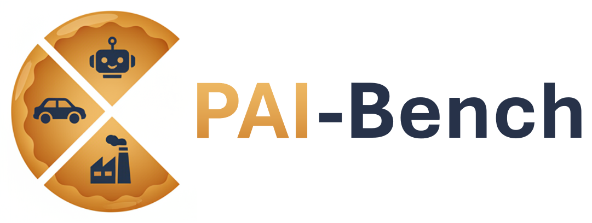
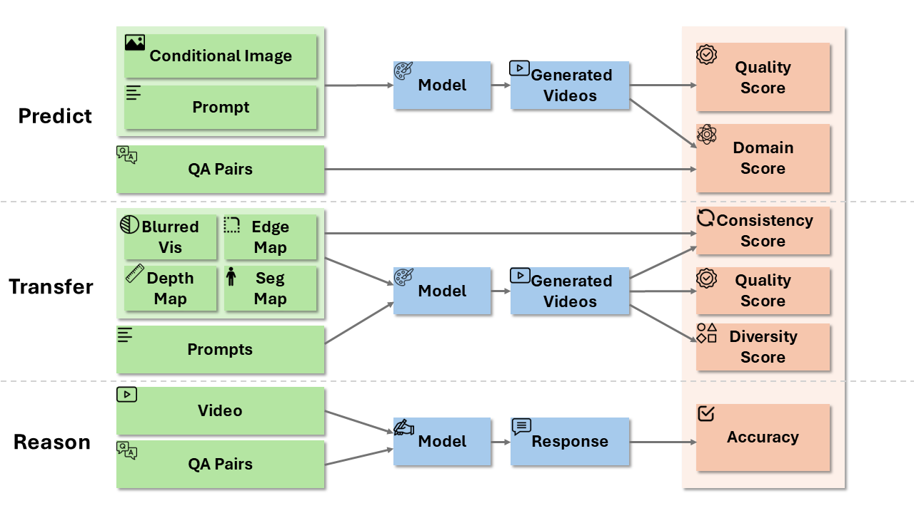

<p align="center">
  
</p>

<p align="center">
  
  
  
  
</p>

## Introduction

Physical AI Bench (PAI-Bench) is a comprehensive benchmark suite for evaluating physical AI generation and understanding. PAI-Bench covers physical scenarios including autonomous vehicle (AV) driving, robotics, industry (smart space) and ego-centric everyday. PAI-Bench contains three subtasks:

- **Predict**: Evaluates world foundation models' ability to predict future states given current states and control signals
- **Transfer**: Focuses on world model generation capabilities with more complex control signals such as edges, segmentation masks, depth, etc.
- **Reason**: Evaluates understanding of physical scenes.

<p align="center">
  
</p>

## Datasets

| Tasks        | Data                                                                                                 | Usage                              |
| ------------ | ---------------------------------------------------------------------------------------------------- | ---------------------------------- |
| **Predict**  | [🤗 physical-ai-bench-predict](https://huggingface.co/datasets/shi-labs/physical-ai-bench-predict)   | [Link](./predict)  |
| **Transfer** | [🤗 physical-ai-bench-transfer](https://huggingface.co/datasets/shi-labs/physical-ai-bench-transfer) | [Link](./transfer) |
| **Reason**   | [🤗 physical-ai-bench-reason](https://huggingface.co/datasets/shi-labs/physical-ai-bench-reason)     | [Link](./reason)   |

## Citation

Paper is coming soon!

If you use Physical AI Bench in your research, please cite:

```bibtex
@misc{PAIBench2025,
  title={Physical AI Bench: A Comprehensive Benchmark for Physical AI Generation and Understanding},
  author={Fengzhe Zhou and Jiannan Huang and Jialuo Li and Humphrey Shi},
  year={2025},
  url={https://github.com/SHI-Labs/physical-ai-bench}
}
```

## Acknowledgements

We would like to thank NVIDIA Research, especially the Cosmos team for their support which led to the creation of PAI-Bench. We also thank Yin Cui, Jinwei Gu, Heng Wang, Prithvijit Chattopadhyay, Andrew Z. Wang, Imad El Hanafi, and Ming-Yu Liu for their valuable feedback and collaboration that helped shaped the project. This research was supported in part by National Science Foundation under Award #2427478 - CAREER Program, and by National Science Foundation and the Institute of Education Sciences, U.S. Department of Education under Award #2229873 - National AI Institute for Exceptional Education. This project was also partially supported by cyberinfrastructure resources and services provided Georgia Institute of Technology.
